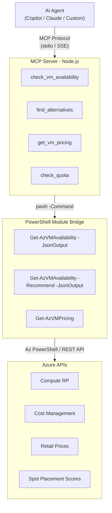

# Roadmap

## Current Release: v1.12.5

See [CHANGELOG.md](CHANGELOG.md) for full version history.

---

## Version 1.0.0 (Initial Release)
- ✅ Multi-region parallel scanning
- ✅ SKU availability and capacity status
- ✅ Zone-level restriction details
- ✅ Quota tracking per family
- ✅ Multi-region comparison matrix
- ✅ Interactive drill-down
- ✅ CSV/XLSX export with conditional formatting
- ✅ Unicode/ASCII icon auto-detection

---

## Version 1.1.0 (Released)
**Theme: Enhanced Interactive Menus**

### Completed Features
- ✅ **Enhanced Region Selection** - Full interactive menu with geo-grouping
- ✅ **Fast Path for Regions** - Type region codes directly to skip menu
- ✅ **Enhanced Family Drill-Down** - SKU selection within each family
- ✅ **SKU Selection Modes** - Choose 'all', 'none', or specific SKUs per family

---

## Version 1.2.0 (Released)
**Theme: SKU Filtering & UX Improvements**

### Completed Features
- ✅ **SKU Filtering** - `-SkuFilter` parameter with wildcard support (e.g., `Standard_D*_v5`)
- ✅ **UX Improvements** - Clearer column names, better zone status display
- ✅ **Improved Messaging** - Consistent terminology throughout

---

## Version 1.3.0 (Released)
**Theme: Pricing Information & Fixed-Width Tables**

### Completed Features
- ✅ **Pricing Information** - Display estimated hourly costs from Azure Retail Prices API
- ✅ **Optional Pricing** - `-ShowPricing` parameter or interactive prompt
- ✅ **Fixed-Width Tables** - Consistent column alignment across all tables
- ✅ **Performance Awareness** - Pricing adds ~5-10 seconds, user is prompted

### New Parameters
- `-ShowPricing` - Include pricing information in output (Linux pay-as-you-go)

---

## Version 1.4.0 (Released)
**Theme: Image Compatibility**

### Completed Features
- [x] **Image Compatibility Check** - Verify if VM images work with selected SKUs
- [x] **Generation Support** - Show Gen1/Gen2 VM support per SKU
- [x] **Architecture Support** - Show x64/ARM64 support per SKU
- [x] **Interactive Image Picker** - 16 common images organized by category
- [x] **Marketplace Search** - Search by publisher or offer name
- [x] **Data Science VMs** - DSVM Ubuntu, DSVM Windows, Azure ML Workstation
- [x] **HPC Images** - Ubuntu HPC, AlmaLinux HPC

### New Parameters
- `-ImageURN` - Check compatibility with specific image (e.g., 'Canonical:0001-com-ubuntu-server-jammy:22_04-lts-gen2:latest')
- `-CompactOutput` - Use compact output for narrow terminals

---

## Version 1.5.0 / 1.5.1 (Released)
**Theme: Pricing Enhancements**

### Completed Features
- ✅ **Negotiated Pricing** - Auto-detect EA/MCA/CSP rates via Cost Management API
- ✅ **Pricing Fallback** - Graceful fallback from negotiated to retail pricing
- ✅ **Sovereign Cloud Pricing** - Correct pricing endpoints for Government/China/Germany clouds

### New Parameters
- `-ShowPricing` enhanced with negotiated rate detection

---

## Version 1.6.0 (Released)
**Theme: Cloud Shell Compatibility & UX**

### Completed Features
- ✅ **Cloud Shell Support** - Fixed-width tables, terminal width detection
- ✅ **Table Explanations** - Added how-to-read guides for all output sections
- ✅ **Excel Legend Sheet** - Dedicated legend sheet in XLSX exports
- ✅ **Improved Multi-Region Matrix** - Dynamic column widths, status explanations

---

## Version 1.7.0 (Released)
**Theme: Code Quality & Resilience**

### Developer Guardrails
- [x] **PSScriptAnalyzer Config** - Shared linter settings for local + CI consistency
- [x] **EditorConfig** - Enforce consistent formatting across editors
- [x] **VS Code Settings** - Lint-on-save for anyone cloning the repo
- [x] **Validation Script** - `tools/Validate-Script.ps1` for pre-commit checks (syntax + lint + tests + AI comment scan + version consistency)
- [x] **PR Template** - Quality checklist for every pull request
- [x] **Copilot Instructions** - Guardrail workflow for AI-assisted development

### Resilience
- [x] **Retry Logic** - `Invoke-WithRetry` helper with exponential backoff for 429/503/transient errors
- [x] **`-MaxRetries` Parameter** - Configurable retry count (default 3)
- [x] **Parallel Retry** - Inline retry loop for region scanning in `-Parallel` block

### Code Cleanup
- [x] **`#region` Blocks** - Replace `# ===` banners with collapsible PowerShell regions
- [x] **Comment Cleanup** - Remove ~30 "what" comments, keep "why" comments
- [x] **Dead Code Removal** - Remove unused functions (`Format-FixedWidthTable`, `Get-SkuSizeAvailability`)
- [x] **Function Organization** - Move `Format-RegionList` to helper functions section
- [x] **Named Constants** - Replace magic numbers with descriptive variables

### Testing
- [x] **Retry Tests** - Pester tests for `Invoke-WithRetry` behavior
- [x] **Helper Function Tests** - Tests for `Get-SkuFamily`, `Get-RestrictionDetails`, `Format-ZoneStatus`, `Test-SkuMatchesFilter`, `Get-CapValue`

### Housekeeping
- [x] **Version Sync** - Align `$ScriptVersion`, CHANGELOG, and ROADMAP
- [x] **Fix Empty Catch** - Add `Write-Verbose` to silent catch block in image search
- [x] **Fix Lint Warnings** - `$matches` variable shadowing, null comparison order

---

## Version 1.8.0 (Released)
**Theme: Capacity Recommender**

### Completed Features
- [x] **`-Recommend` Parameter** - Find alternatives when a target SKU is unavailable
- [x] **Similarity Scoring** - Rank available SKUs by closeness to target (vCPU, memory, family, gen, arch)
- [x] **`-TopN` Parameter** - Control number of alternatives returned (default 5)
- [x] **Minimum similarity threshold** - `-MinScore` parameter (default 50) filters out low-similarity SKUs (set 0 to show all)
- [x] **`-JsonOutput`** - Structured JSON output for Agent/automation consumption
- [x] **Copilot CLI Examples** - Rich `.EXAMPLE` blocks for `gh copilot suggest` discoverability

### Testing
- [x] **Scoring Tests** - 16 Pester tests for `Get-SkuSimilarityScore` function

## Future Enhancements (Backlog)

### Capacity Recommender Enhancements
- [ ] **Fleet Planning** - Distribute vCPU requirements across regions (`-FleetSize`)
- [ ] **Workload Profiles** - Pre-tuned scoring weights for MemoryOptimized, ComputeOptimized, GPU
- [ ] **`-AnyRegion`** - Scan all public regions automatically
- [ ] **`-RegionGeo`** - Filter by geography (US, Europe, AsiaPacific)
- [ ] **Agent Integration** - `find_alternatives` tool in AzVMAvailability-Agent

### PowerShell Module Refactoring
- [ ] **Module Structure** - Refactor into `AzVMAvailability` module with Public/Private functions
- [ ] **Backward-Compatible Wrapper** - Keep `Get-AzVMAvailability.ps1` as entry point
- [ ] **Shared Helpers** - Enable reuse across scanner, recommender, and Agent

### Azure Resource Graph Integration
- [ ] **Current VM Inventory** - Show existing VMs deployed per region/SKU family
- [ ] **Cross-Subscription Discovery** - Use ARG to discover all accessible subscriptions faster
- [ ] **Deployment Density** - Visualize how many VMs are already in each region
- [ ] **Compare Available vs Deployed** - Side-by-side view of capacity vs current usage

### Enhanced Reporting
- [ ] **HTML Report Export** - Self-contained HTML report with charts
- [ ] **Trend Tracking** - Compare against previous scan results
- [ ] **Email/Chat Notifications** - Send results via email, Slack, or Teams webhooks

### Pricing Enhancements
- [ ] **Windows Pricing** - Add `-PricingType` parameter for Windows/Linux/Both
- [ ] **Spot Pricing** - Include spot instance pricing comparison
- [ ] **Monthly Estimates** - Show projected monthly costs

### Advanced Monitoring
- [ ] **Watch Mode** - Continuous monitoring with alerts
- [ ] **Capacity Alerts** - Notify when capacity status changes
- [ ] **Azure Function Deployment** - Run as scheduled serverless function

---

## Version 2.0.0 (Future)
**Theme: Module Implementation**

- [ ] **Module Structure** - Refactor into `AzVMAvailability` module with Public/Private functions
- [ ] **Backward-Compatible Wrapper** - Keep `Get-AzVMAvailability.ps1` as entry point
- [ ] **Shared Helpers** - Enable reuse across scanner, recommender, and Agent
- [ ] **Module Manifest + Validation** - Add and validate `.psd1` manifest in CI
- [ ] **Migration Guidance** - Document script-to-module migration path and examples

---

## Version 1.12.0 (Future)
**Theme: Fleet Planning**

- [ ] **Fleet Planning** - Distribute vCPU requirements across regions (`-FleetSize`)
- [ ] **Workload Profiles** - Pre-tuned scoring weights for MemoryOptimized, ComputeOptimized, GPU
- [ ] **VMSS Script Generation** - Generate deployment scripts for regional fleet allocation
- [ ] **Fleet Strategy Modes** - Balanced/HighAvailability/CostOptimized/MaxSavings
- [ ] **Azure Compute Fleet Integration** - Evaluate `Microsoft.AzureFleet/fleets` API for mixed Spot+on-demand fleet deployments (requires `Compute Fleet Contributor` role `2bed379c`) <!-- short GUID is intentional — roadmap reference, not RBAC assignment code -->
- [ ] **Programmatic Quota Management** - Evaluate `Microsoft.ComputeLimit` API for automated quota increase requests (requires `Compute Limit Operator` role `980cf6f7`) <!-- short GUID is intentional — roadmap reference, not RBAC assignment code -->

---

## Version 2.1.0 (Future)
**Theme: MCP Server Interface** ([#28](https://github.com/ZacharyLuz/Get-AzVMAvailability/issues/28))

Expose VM availability data as MCP tools so AI coding agents (Copilot, Claude, etc.) can pre-validate SKU selection during Terraform/Bicep authoring — before deployment fails.

### MCP Tools
- [ ] **`check_vm_availability`** - Check if a specific SKU is available in a region (capacity, restrictions, zones)
- [ ] **`find_alternatives`** - Find similar available SKUs when the target is unavailable (wraps `-Recommend`)
- [ ] **`get_vm_pricing`** - Get retail/negotiated pricing for a SKU in a region
- [ ] **`check_quota`** - Check subscription quota for a SKU family in a region

### Server Infrastructure
- [ ] **MCP Server Process** - Node.js MCP server using `@modelcontextprotocol/sdk` that shells out to the PowerShell module
- [ ] **PowerShell Module Bridge** - Thin adapter layer: MCP tool → `pwsh -Command "Import-Module AzVMAvailability; ..."` → JSON response
- [ ] **Authentication Passthrough** - Use caller's existing `Az.Accounts` session (no credential storage in MCP server)
- [ ] **Container Option** - Dockerfile with PowerShell 7 + Az modules + MCP server for portable deployment

### Architecture

### Dependencies
- Requires **v2.0.0 Module Implementation** (exported functions for clean tool invocation)
- Benefits from v1.11.0 Placement Scores and v1.12.0 Fleet Planning data

---

## Version 2.2.0 (Future)
**Theme: Proactive Monitoring**

- [ ] **Watch Mode** - Continuous monitoring with alerts
- [ ] **Capacity Alerts** - Notify when capacity status changes
- [ ] **Azure Monitor Integration** - Log results to Log Analytics
- [ ] **Azure Function Deployment** - Run as scheduled serverless function
- [ ] **REST API Wrapper** - Expose as lightweight API

---

## Future: AVD Capacity Planning Mode
**Theme: Azure Virtual Desktop Host Pool Sizing**

AVD deployments depend on VM SKU availability and quota (already covered), but a dedicated AVD mode would close the remaining gap between raw capacity data and host pool readiness.

### Proposed Features
- [ ] **`-AvdMode` Parameter** - Switch to AVD-focused output with host pool context
- [ ] **Session Model Input** - Accept user count + session type (Personal vs Pooled) to compute required VM count
- [ ] **VM Count Calculator** - Derive required VMs from concurrent user target and users-per-VM ratio
- [ ] **Host Pool Quota Check** - Validate that subscription quota covers the full host pool VM count
- [ ] **SKU Guidance** - Flag AVD-recommended families (DSv5, Dasv5, NVv4 for GPU) and warn on unsupported SKUs
- [ ] **Spot Integration** - Flag pooled hosts as Spot-eligible when eviction tolerance is low (links to placement score feature)
- [ ] **Capacity + Quota Pass/Fail Summary** - Single green/red readiness signal per region

### Notes
- Builds on existing SKU availability + quota scan — no new Azure API dependency
- Pooled host sizing math: `ceil(ConcurrentUsers / UsersPerVM)` with optional buffer percentage
- Personal host sizing math: `1 VM per assigned user`
- Spot placement scores (feature/placement-score-phase1) are directly relevant for cost-optimized pooled AVD
- AVD session planning decisions needed before implementation

---

## Future: SKU Modernization Scanner
**Theme: Proactive SKU Retirement & Capacity Risk Detection**

Scan a subscription's deployed VMs to find SKUs that are scheduled for retirement, deprecated, or running in low-capacity regions — then recommend newer replacement SKUs with better availability.

### Proposed Features
- [ ] **`-Modernize` Parameter** - Interactive mode that discovers deployed VMs and flags at-risk SKUs
- [ ] **ARG Inventory Scan** - Use Azure Resource Graph to enumerate all deployed VMs by region, SKU, and resource group
- [ ] **Retirement Detection** - Cross-reference deployed SKUs against Azure's published retirement/deprecation schedule (Compute RP `resourceSkus` with `NotAvailableForNewDeployments` restrictions)
- [ ] **Low-Capacity Flagging** - Identify deployed SKUs where current capacity status is `NotAvailable` or `Restricted` in the deployment region
- [ ] **Upgrade Recommendations** - For each at-risk SKU, run the existing similarity scoring engine (`-Recommend`) to suggest newer replacements with `Available` capacity
- [ ] **Generation Gap Detection** - Flag VMs running on older generations (v2/v3/v4) when v5/v6 equivalents exist in the same family
- [ ] **Side-by-Side Comparison** - Table showing current SKU vs recommended upgrade with vCPU, memory, pricing, and capacity delta
- [ ] **Migration Impact Summary** - Per-VM output: resource group, VM name, current SKU, risk reason, top recommendation, pricing delta
- [ ] **Export Support** - CSV/XLSX/JSON export of modernization report for fleet planning

### Data Sources
- **Deployed VMs:** Azure Resource Graph (`Microsoft.Compute/virtualMachines`)
- **SKU Retirement Status:** Compute RP `resourceSkus` API — restrictions array contains `NotAvailableForNewDeployments` for retiring SKUs
- **Capacity Status:** Existing capacity scanning logic (already built)
- **Replacement Scoring:** Existing `Get-SkuSimilarityScore` engine (already built)
- **Pricing:** Existing retail/negotiated pricing pipeline (already built)

### Interactive Flow
1. Scan subscription via ARG → list all unique deployed SKUs by region
2. Check each SKU for retirement restrictions and capacity status
3. Flag at-risk SKUs (retiring, restricted, low capacity)
4. For each flagged SKU, run recommend engine to find available replacements
5. Present color-coded summary: green (healthy), yellow (low capacity), red (retiring/unavailable)
6. User selects which replacements to include in export report

### Dependencies
- Benefits from **ARG Integration** backlog items (VM inventory, cross-subscription discovery)
- Reuses **v1.8.0 Recommend Engine** (`Get-SkuSimilarityScore`, `-Recommend`, `-TopN`)
- Reuses **v1.3.0 Pricing** pipeline for cost delta calculations

### Notes
- `NotAvailableForNewDeployments` in the `resourceSkus` restrictions array is the programmatic signal for SKU retirement — no scraping of retirement announcement pages needed
- Existing VMs on retiring SKUs continue to run but cannot be resized, redeployed after deallocation, or added to scale sets
- Generation detection heuristic: parse version suffix from SKU name (e.g., `Standard_D4s_v3` → v3, compare against `Standard_D4s_v5` → v5)

---

## Contributing

Have ideas for new features? Open an issue or submit a PR!

See [CONTRIBUTING.md](CONTRIBUTING.md) for guidelines.
